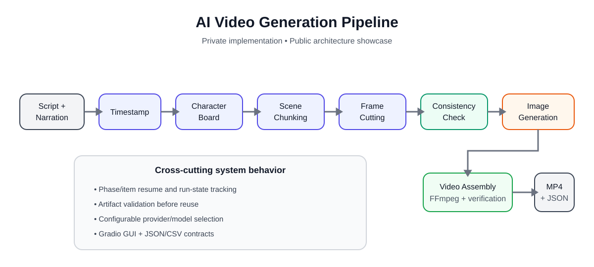

# AI Video Generation Pipeline — Showcase

A **local, Python-based workflow system** for turning a script and narration into
timed scenes, generated illustrations, and an assembled short-form video.

> **Portfolio showcase only.**  
> The production source repositories are private. This repository intentionally
> contains no credentials, private prompts, browser profiles, local paths, personal
> media, or proprietary implementation source.

## What the project does

The system coordinates the handoff between transcription/timing, visual planning,
image generation, validation, and final video assembly.

```text
Script + narration / timestamp files
        │
        ▼
    Timestamp
        │
        ▼
 Character Board
        │
        ▼
 Scene Chunking
        │
        ▼
  Frame Cutting
        │
        ▼
Consistency Check
        │
        ▼
Image Generation
        │
        ▼
 Video Assembly
        │
        ▼
 MP4 + structured assembly artifacts
```

## Core capabilities

- **Phase-based orchestration** with configurable pipeline stages.
- **Resume support** at phase and item level instead of restarting the whole run.
- **Artifact validation** before completed work is reused.
- **Provider abstraction** for local tools and external model providers.
- **Local GUI** built with Gradio, with an optional desktop-style pywebview wrapper.
- **Structured JSON/CSV contracts** between planning, generation, and rendering stages.
- **FFmpeg-based local video assembly** with timing, narration, captions, sizing,
  motion/fade decisions, and output verification.
- **Optional screen/browser automation integration** through a separate execution
  component using JSON/subprocess contracts.
- **Mock/offline modes and regression tests** for pipeline behavior without requiring
  live paid services.

## Architecture



The orchestration layer owns pipeline state, prompts, planning, validation, and
recovery policy. Screen/browser execution is separated into a companion automation
component so application interaction can change without duplicating pipeline logic.

A key design principle is that **existing output files are not automatically trusted**.
Resume/reuse requires outputs to match the expected phase/item state and validation
rules.

## Example workflow

1. Select a script and narration or timestamp source.
2. Build timing information.
3. Create a reusable character board.
4. Divide the script into timed scenes.
5. Plan individual frames and image prompts.
6. Run consistency checks.
7. Generate frame images.
8. Assemble the final vertical video locally with FFmpeg.
9. Verify the produced media and retain structured artifacts for reproducibility.

## Technologies

| Area | Technologies |
|---|---|
| Core | Python |
| Local UI | Gradio, pywebview |
| Video | FFmpeg, ffprobe |
| Data contracts | JSON, CSV |
| Timing | Local files, optional WhisperX / transcription providers |
| AI providers | Configurable local/API providers |
| Browser/UI execution | Playwright and Windows UI automation in a separate component |
| Testing | pytest, deterministic mocks/fakes |

## Engineering problems addressed

### Resumable multi-stage workflows

Long media-generation workflows fail in different places. The project tracks
phase/item completion and validates artifacts so a failed run can continue from
usable work rather than blindly restarting.

### Separation of planning and UI automation

The pipeline decides **what should happen**. A companion execution component handles
**how a browser/desktop application is operated**. They communicate through structured
contracts and manifests instead of sharing copied source.

### Reproducible video assembly

Final rendering uses a structured assembly plan rather than inferring timing from
filenames. The FFmpeg path supports deterministic frame boundaries, captions,
narration, sizing, motion/fades, and post-render verification.

### Provider flexibility

Pipeline phases can select different providers/models. Disabled stages do not need
their provider credentials, and mock providers support offline development.

## Current status

This is an **actively developed local application**, primarily exercised on Windows
with Python 3.12. It is a personal engineering project rather than a hosted production
service.

Development is AI-assisted. My contribution includes requirements definition,
workflow/system design, architecture decisions, integration, debugging,
validation, and iterative refinement. I do not claim that every line of the private
implementation was manually authored.

## What is intentionally not public

The following remain private:

- production source code
- private prompt assets and local configuration
- credentials/API keys
- browser/session state
- machine-specific paths and coordinates
- personal audio/video/media
- generated run data
- internal debugging artifacts

This showcase exists to demonstrate the **system design, implementation scope, and
engineering decisions** without publishing the underlying private repository.

## Repository note

If you are reviewing this project for a role and need more technical detail, I can
discuss the architecture, debugging process, design decisions, and selected
sanitized implementation examples.
